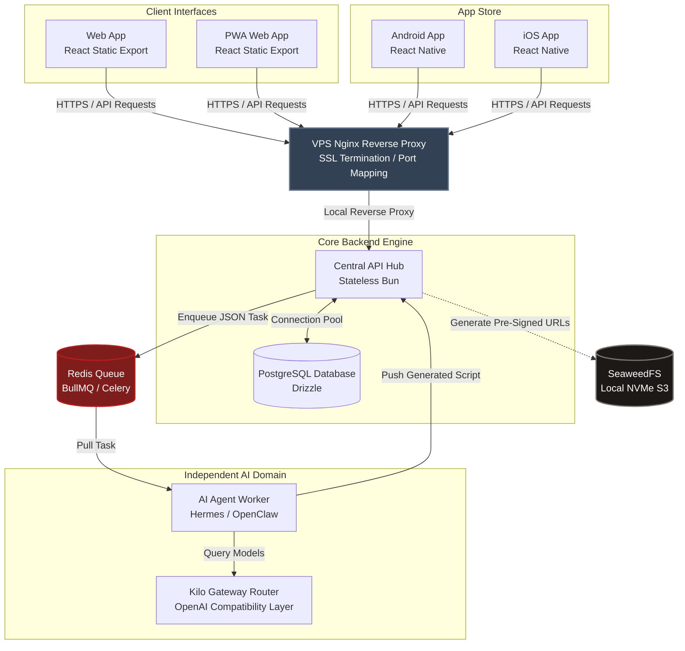

# chaosfairy

## Architecture

```mermaid
graph TD
    %% Cloudflare
    subgraph ClientInterfaces [Client Interfaces]
        Web[Web App<br>React Static Export]
        PWA[PWA Web App<br>React Static Export]
    end

    %% App Store
    subgraph AppStore [App Store]
        iOS[iOS App<br>React Native]
        Android[Android App<br>React Native]
    end

    %% Network Entry
    Proxy[VPS Nginx Reverse Proxy<br>SSL Termination / Port Mapping]

    %% Core Services
    subgraph CoreBackend [Core Backend Engine]
        API[Central API Hub<br>Stateless Bun]
        DB[(PostgreSQL Database<br>Drizzle)]
    end

    Queue[(Redis Queue<br>BullMQ / Celery)]
    Storage[(SeaweedFS<br>Local NVMe S3)]

    %% Isolated AI Execution
    subgraph AIEngine [Independent AI Domain]
        Worker[AI Agent Worker<br>Hermes / OpenClaw]
        Kilo[Kilo Gateway Router<br>OpenAI Compatibility Layer]
    end

    %% Traffic Routes
    Web & PWA & Android & iOS -->|HTTPS / API Requests| Proxy
    Proxy -->|Local Reverse Proxy| API
    API <-->|Connection Pool| DB

    API -->|Enqueue JSON Task| Queue
    Queue -->|Pull Task| Worker
    Worker -->|Query Models| Kilo
    Worker -->|Push Generated Script| API

    API -.->|Generate Pre-Signed URLs| Storage

    %% Layout Classes for Styling
    style Proxy fill:#334155,stroke:#64748b,stroke-width:2px,color:#fff
    style Storage fill:#1c1917,stroke:#78716c,stroke-width:2px,color:#fff
    style Queue fill:#7f1d1d,stroke:#b91c1c,stroke-width:2px,color:#fff
```

## Directory structure

* web
* pwa
* mobile/android
* mobile/ios
* services/api
* services/ai
* packages/db
* packages/ui
